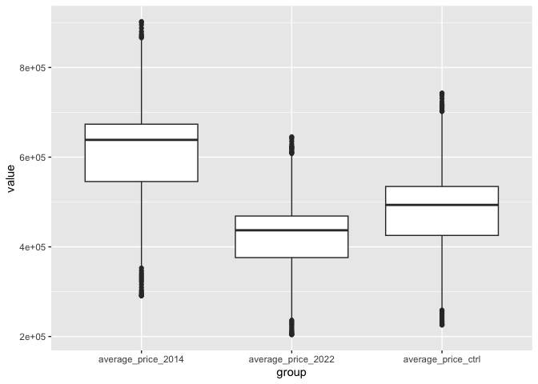
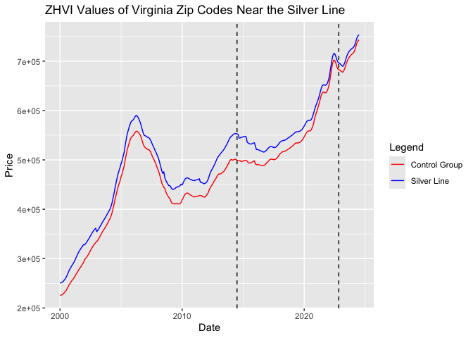

# How does the opening of the Silver Line affect housing costs?
2024 FIRE198 Sustainability Analytics

## Team Members

Raphael Coronel, Taylor Woods, Brian Huang, Joseph Tang

## Research Question

***How did the opening/announcement of the Silver Line affect housing
costs?***

## Background

This research project aims to address one question: How has the
expansion of public transportation, such as the Silver Line, affected
housing prices in the Washington D.C Metropolitan Area? The Silver Line
has two significant expansions in Fairfax and Loudoun County that are
broken up into 2 phases. The first phase is 2014-2022, where the metro
line connects McLean, VA to Reston, VA. The second phase is 2022 to the
present, where the metro line continues towards Ashburn, VA.
Understanding the effect of the presence of public transportation, like
metro lines, especially the Silver Line, on the prices of homes can have
a serious effect on the way public transportation is perceived by policy
makers and homebuyers. Public transit plays a vital role in shaping
urban development patterns, which influence accessibility and property
values. As public transportation networks expand, they often improve
connectivity, reducing commute times and increasing access to employment
centers (Saif et al., 2019). This can lead to an increase in demand for
housing in neighborhoods served by transit, potentially driving up
housing prices. Alternatively, transit expansion can spur development in
neglected areas, resulting in the displacement of current residents.
This research question can be answered by comparing the difference in
price between houses that are not in proximity to the Silver Line,
houses that are within the proximity of phase 1 in 2014, and houses that
are within the proximity of phase 2 in 2022. The results of these
findings will help policymakers make more informed decisions about
transit investments, urban planning and affordable housing initiatives.
On top of that, it will help inform equitable development strategies to
ensure transportation improvements benefit all residents and their
community conditions.

We know the Silver Line has developed in two phases thus affecting the
people’s usage of it who live in the area. Additionally, we have
information about how house prices change throughout the course of
months and years based on the location they are in. Housing prices have
fluctuated based on the implementation of public transport, but we have
a gap in information for the Washington D.C Metropolitan area. We know
from past research that houses tend to increase in price based on their
“closeness” to the station (Forrest et al., 1996). This is also proven
by the Atlanta Beltline where the outcome was that homes increased in
value by 30-40 percent if they were within a mile of the BeltLine
(Girard, 2018). By looking at the two phases of the Silver Line, we can
examine how the surrounding houses have fluctuated in price. This will
help us get an understanding of how our area has adjusted due to more
opportunity to use these services and how implementation in the future
can change the housing market. Furthermore, we can observe how the
distance from the Silver Line in our area is a factor in home costs by
looking at how other forms of public transport have affected their
nearby areas and apply our datasets and research to look at the effects
in the Washington D.C Metropolitan area.

## Data

Our data source is the ZHVI (Zillow Home Value Index) which collects the
house price of different areas.

Clean data here.

``` r
library("tidyverse")
library("glue")

df <- read.csv("dfdmv_with_treatment_NEW.csv")
```

``` r
df2 <- df %>% filter( df$CountyName == "Loudoun County" | df$CountyName == "Fairfax County")
```

``` r
df3<- df2 %>% mutate(date=as.Date(date)) %>% 
  mutate(open_2014=ifelse(date>as.Date("2014-07-01"),1,0))%>%
  mutate(open_2022=ifelse(date>as.Date("2022-11-01"),1,0))
```

## Preliminary Results

## Question 1: What is the frequency of this data frame?

Answer: once a month

## Question 2: What is the cross-sectional (geographical) unit of this data frame?

Answer: zip code

``` r
names(df3)
```

     [1] "X"            "RegionName"   "BedroomCnt"   "State"        "City"        
     [6] "CountyName"   "Price"        "Year"         "Month"        "date"        
    [11] "station_open" "zip_in_2014"  "zip_in_2022"  "open_2014"    "open_2022"   

Treatment variable: station_open

Outcome variable: Price

The box plot below illustrates the price distributions across our two
treated and one untreated groups.

``` r
df_2014 <- df3 %>%
  filter(zip_in_2014==1) %>%
  group_by(date) %>%
  summarize(average_price_2014 = mean(Price))

df_2022 <- df3 %>%
  filter(zip_in_2022==1) %>%
  group_by(date) %>%
  summarize(average_price_2022 = mean(Price))

df_years <- df_2014 %>% left_join(df_2022, by="date")

df_control <- read.csv("dfsilvercontrol.csv")

df_control2 <- df_control %>%
  group_by(date) %>%
  summarize(average_price_ctrl = mean(Price))

df_control2$date <- as.Date(df_control2$date)

df_combined <- df_control2 %>% left_join(df_years, by="date")

df_boxplot <- df_combined %>%
  pivot_longer(
    cols = c('average_price_ctrl', 'average_price_2014', 'average_price_2022'),     # Specify the columns to pivot
    names_to = "group",                    # New column for group (control, 2014, 2022)
    values_to = "value"                    # New column for values
  )

ggplot(df_boxplot, aes(group,value)) +
  geom_boxplot()
```



``` r
model1<-lm(Price ~ (zip_in_2014*open_2014)+(zip_in_2022*open_2022), data=df3)

summary(model1)
```


    Call:
    lm(formula = Price ~ (zip_in_2014 * open_2014) + (zip_in_2022 * 
        open_2022), data = df3)

    Residuals:
        Min      1Q  Median      3Q     Max 
    -662485 -180713  -26658  145409 1318862 

    Coefficients:
                          Estimate Std. Error t value Pr(>|t|)    
    (Intercept)             559209       6596  84.785  < 2e-16 ***
    zip_in_2014              46069       7504   6.139 8.60e-10 ***
    open_2014               110466       6656  16.597  < 2e-16 ***
    zip_in_2022            -198980       6130 -32.462  < 2e-16 ***
    open_2022               186716      17029  10.965  < 2e-16 ***
    zip_in_2014:open_2014    59012      10760   5.484 4.25e-08 ***
    zip_in_2022:open_2022   -60827      20557  -2.959  0.00309 ** 
    ---
    Signif. codes:  0 '***' 0.001 '**' 0.01 '*' 0.05 '.' 0.1 ' ' 1

    Residual standard error: 267500 on 11067 degrees of freedom
    Multiple R-squared:  0.2231,    Adjusted R-squared:  0.2227 
    F-statistic: 529.7 on 6 and 11067 DF,  p-value: < 2.2e-16

## Question 5: What is the predicted value of the outcome variable when treatment=0?

Answer: 559209

## Question 6: What is predicted value of the outcome variable when treatment=1?

Answer:

2014:

559209+46069+110466+59012=774756

2022:

559209+(-198980)+186716+(-60827)=486118

## Question 7: What is the equation that describes the linear regression above? Please include an explanation of the variables and subscripts.

Answer:

$$
Price_{it} = \beta_0 \times (\text{zip_in_2014}\times \text{open_2014})+ \beta_1 \times \text{zip_in_2014}_i + \beta_3 \times \text{open_2014}_t + \\ \gamma_1 (\text{zip_in_2022}_i \times \text{open_2022}_t)+\gamma_2 (\text{zip_in_2022}_i \times \text{open_2022}_t)+\gamma_3 (\text{zip_in_2022}_i \times \text{open_2022}_t) +\epsilon_{it}
$$

## Question 8: What fixed effects can be included in the regression? What does each fixed effects control for? Please include a new equation that incorporates the fixed effects.

Answer: Month, Year, CountyName, BedroomCnt, RegionName (zip code)

## Question 9: What is the impact of the treatment effect once fixed effects are included?

Answer:

``` r
model2<-lm(Price ~ (zip_in_2014*open_2014)+(zip_in_2022*open_2022)+ as.factor(Month) + as.factor(Year) + as.factor(CountyName) + as.factor(BedroomCnt),data=df3)
summary(model2)
```


    Call:
    lm(formula = Price ~ (zip_in_2014 * open_2014) + (zip_in_2022 * 
        open_2022) + as.factor(Month) + as.factor(Year) + as.factor(CountyName) + 
        as.factor(BedroomCnt), data = df3)

    Residuals:
        Min      1Q  Median      3Q     Max 
    -336134  -75266  -16047   54599  863440 

    Coefficients:
                                        Estimate Std. Error t value Pr(>|t|)    
    (Intercept)                           -46473       9742  -4.770 1.86e-06 ***
    zip_in_2014                           102952       3980  25.866  < 2e-16 ***
    open_2014                             -12022      13298  -0.904  0.36599    
    zip_in_2022                          -196381       3279 -59.883  < 2e-16 ***
    open_2022                              27684      23543   1.176  0.23965    
    as.factor(Month)2                       2121       6287   0.337  0.73592    
    as.factor(Month)3                       4568       6287   0.727  0.46749    
    as.factor(Month)4                       7397       6287   1.176  0.23944    
    as.factor(Month)5                      10223       6286   1.626  0.10390    
    as.factor(Month)6                      12424       6286   1.977  0.04811 *  
    as.factor(Month)7                      13874       6286   2.207  0.02732 *  
    as.factor(Month)8                      15149       6392   2.370  0.01780 *  
    as.factor(Month)9                      16129       6391   2.524  0.01162 *  
    as.factor(Month)10                     17312       6391   2.709  0.00676 ** 
    as.factor(Month)11                     18902       6391   2.958  0.00311 ** 
    as.factor(Month)12                     21284       6478   3.286  0.00102 ** 
    as.factor(Year)2001                    45015      10152   4.434 9.33e-06 ***
    as.factor(Year)2002                    85737       9993   8.579  < 2e-16 ***
    as.factor(Year)2003                   128637       9852  13.058  < 2e-16 ***
    as.factor(Year)2004                   193957       9852  19.688  < 2e-16 ***
    as.factor(Year)2005                   296731       9852  30.120  < 2e-16 ***
    as.factor(Year)2006                   331029       9852  33.602  < 2e-16 ***
    as.factor(Year)2007                   289118       9787  29.540  < 2e-16 ***
    as.factor(Year)2008                   228053       9793  23.288  < 2e-16 ***
    as.factor(Year)2009                   193019       9726  19.845  < 2e-16 ***
    as.factor(Year)2010                   215820       9669  22.321  < 2e-16 ***
    as.factor(Year)2011                   216640       9641  22.471  < 2e-16 ***
    as.factor(Year)2012                   244203       9613  25.403  < 2e-16 ***
    as.factor(Year)2013                   288174       9613  29.977  < 2e-16 ***
    as.factor(Year)2014                   319527      11080  28.838  < 2e-16 ***
    as.factor(Year)2015                   326564      16232  20.119  < 2e-16 ***
    as.factor(Year)2016                   331284      16172  20.485  < 2e-16 ***
    as.factor(Year)2017                   339258      16171  20.980  < 2e-16 ***
    as.factor(Year)2018                   354138      16171  21.900  < 2e-16 ***
    as.factor(Year)2019                   369683      16171  22.861  < 2e-16 ***
    as.factor(Year)2020                   396350      16171  24.510  < 2e-16 ***
    as.factor(Year)2021                   453136      16171  28.022  < 2e-16 ***
    as.factor(Year)2022                   510729      16304  31.325  < 2e-16 ***
    as.factor(Year)2023                   531878      27874  19.081  < 2e-16 ***
    as.factor(Year)2024                   570026      28546  19.969  < 2e-16 ***
    as.factor(CountyName)Loudoun County    47834       3482  13.737  < 2e-16 ***
    as.factor(BedroomCnt)2                130855       4732  27.655  < 2e-16 ***
    as.factor(BedroomCnt)3                282572       4657  60.680  < 2e-16 ***
    as.factor(BedroomCnt)4                465251       4672  99.589  < 2e-16 ***
    as.factor(BedroomCnt)5                658186       4772 137.939  < 2e-16 ***
    zip_in_2014:open_2014                   7008       5507   1.273  0.20322    
    zip_in_2022:open_2022                 -59862      10468  -5.719 1.10e-08 ***
    ---
    Signif. codes:  0 '***' 0.001 '**' 0.01 '*' 0.05 '.' 0.1 ' ' 1

    Residual standard error: 136200 on 11027 degrees of freedom
    Multiple R-squared:  0.7993,    Adjusted R-squared:  0.7985 
    F-statistic: 954.7 on 46 and 11027 DF,  p-value: < 2.2e-16

# Questions for Week 5

## Question 10: In a difference-in-differences (DiD) model, what is the treatment GROUP?

Answer: zip_in_2014, zip_in_2022

## Question 11: In a DiD model, what are the control groups?

Answer: other houses in Fairfax and Loudoun county.

## Question 12: What is the DiD regression equation that will answer your research question?

## Question 13: Run your DiD regressions below. What are the results of the DiD regression?

When the first part of the rail opened, the house prices increased by
7008.

When the second part of the rail opened, the house prices decreased by
59862.

## Question 14: What are the next steps of your research?

Look at impact of bedroom counts, as well as other potential variables
like mortgage rates to further minimize the confounding variables.

## Preliminary Graph

``` r
ggplot()+
  geom_line(data=df_combined, aes(x=date,y=average_price_2014,col="Expansion Phase 1")) +
  geom_line(data=df_combined, aes(x=date,y=average_price_2022,col="Expansion Phase 2")) +
  geom_line(data=df_combined, aes(x=date,y=average_price_ctrl,col="Control Group")) +
  geom_vline(xintercept = as.numeric(as.Date("2014-07-01")), color="blue",linetype="dashed") +
  geom_vline(xintercept = as.numeric(as.Date("2022-11-01")), color="purple",linetype="dashed") +
  scale_color_manual("Legend", values=c("red", "blue","purple")) +
  labs(title = "ZHVI Values of Virginia Zip Codes Near the Silver Line Expansion", x = "Date", y = "Price")
```


## Discussion
Based on the data collected and the models run, it can be concluded that house prices in Loudoun and Fairfax County were affected by the introduction of the Silver Line. Phase I seems to have caused an increase of around 40,000 dollars, while Phase II caused a decrease of around 60,000 dollars. The results of Phase I are generally in line with other price trends in other lines, such as the Atlanta Beltline (Girard, 2018). However, the decrease in Phase II contradicts the house price trends of the later stages of the pandemic era. There are a multitude of reasons for this. The most likely is that there are more variables in play that were not accounted for. Another potential cause is discrepancies in initial prices. Since the house prices were not uniform throughout the stations opened in Phase I and Phase II, the house price change could be biased one way or the other. For example, if a house in an area where Phase II opened was initially priced at 600,000 dollars and decreased by 60,000. That is a 10 percent increase. However, if a house in an area where Phase I opened was priced at 300,000, an increase or decrease of that magnitude would indicate a much larger percentage increase.

## Future Plans
In future studies, it was be beneficial to include changes in mortgage rates and crime rates and account for natural disaster occurrences. Additionally, we can measure percentage change instead of the raw numerical change in price.

## References

Zillow Home Value Index. \[Dataset\]. Zillow
Inc. https://www.zillow.com/research/data/

Forrest, D., Glen, J., & Ward, R. (1996). The impact of a light rail
system on the structure of house prices: a hedonic longitudinal study.
Journal of Transport economics and Policy, 15-29.

Girard, P. (2018). URBAN REDEVELOPMENT AND HOUSING VALUES: A CASE STUDY
OF THE ATLANTA BELTLINE.
