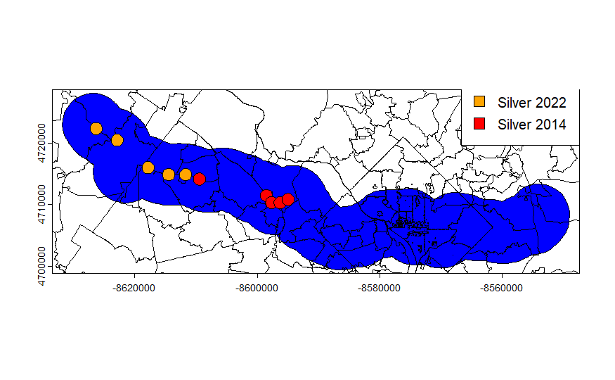
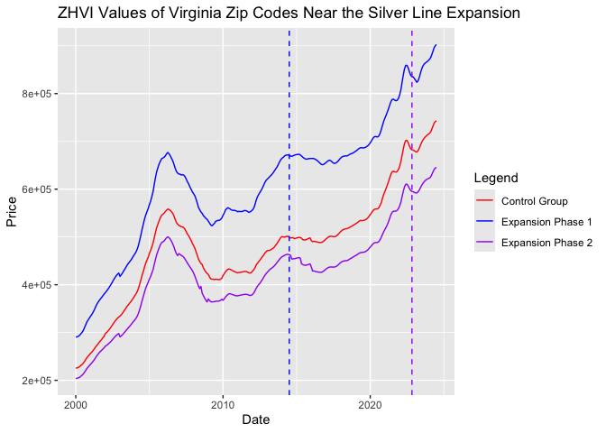

# How did the opening of the Silver Line affect housing costs?
2024 FIRE198 Sustainability Analytics

## Team Members

Raphael Coronel, Taylor Woods, Brian Huang, Joseph Tang

## Research Question

***How did the opening/announcement of the Silver Line affect housing
costs?***

## Introduction

This research project aims to address one question: How has the
expansion of public transportation, such as the Silver Line, affected
housing prices in the Washington D.C Metropolitan Area? The Silver Line
has two significant expansions in Fairfax and Loudoun County that are
broken up into 2 phases. The first phase is 2014-2022, where the metro
line connects McLean, VA to Reston, VA. The second phase is 2022 to the
present, where the metro line continues towards Ashburn, VA.
Understanding the effect of the presence of public transportation, like
metro lines, especially the Silver Line, on the prices of homes can have
a serious effect on the way public transportation is perceived by policy
makers and homebuyers. Public transit plays a vital role in shaping
urban development patterns, which influence accessibility and property
values. As public transportation networks expand, they often improve
connectivity, reducing commute times and increasing access to employment
centers (Saif et al., 2019). This can lead to an increase in demand for
housing in neighborhoods served by transit, potentially driving up
housing prices. Alternatively, transit expansion can spur development in
neglected areas, resulting in the displacement of current residents.
This research question can be answered by comparing the difference in
price between houses that are not in proximity to the Silver Line,
houses that are within the proximity of phase 1 in July 2014, and houses
that are within the proximity of phase 2 in November 2022. The results
of these findings will help policymakers make more informed decisions
about transit investments, urban planning and affordable housing
initiatives. On top of that, it will help inform equitable development
strategies to ensure transportation improvements benefit all residents
and their community conditions.

## Existing Research

We know the Silver Line has developed in two phases thus affecting the
people’s usage of it who live in the area. Additionally, we have
information about how house prices change throughout the course of
months and years based on the location they are in. Housing prices have
fluctuated based on the implementation of public transport, but we have
a gap in information for the Washington D.C Metropolitan area. We know
from past research that houses tend to increase in price based on their
“closeness” to the station (Forrest et al., 1996). This is also proven
by the Atlanta Beltline where the outcome was that homes increased in
value by 30-40 percent if they were within a mile of the BeltLine
(Girard, 2018). By looking at the two phases of the Silver Line, we can
examine how the surrounding houses have fluctuated in price. This will
help us get an understanding of how our area has adjusted due to more
opportunity to use these services and how implementation in the future
can change the housing market. Furthermore, we can observe how the
distance from the Silver Line in our area is a factor in home costs by
looking at how other forms of public transport have affected their
nearby areas and apply our datasets and research to look at the effects
in the Washington D.C Metropolitan area.

## Data Description

### Outcome variable:

- Our outcome variable is the ZHVI (Zillow Home Value Index) for zip
  codes near the Silver Line which we renamed to “Price”. This measures
  the typical home value in US dollars for a specified region.

### Treatment variable:

- The treatment variables are if a zip code is within 5 kilometers of a
  Silver Line station and if so, during which phase was that station
  opened (zip_in_2014, zip_in_2022) and if the station has opened yet at
  the specified month.

### Frequency/Geographic unit:

- **Frequency**: This dataset is monthly, with nationwide observations
  ranging from January 2000 until July 2024. The ZHVI dataset can be
  found at <https://www.zillow.com/research/data/>

- **Geographic unit:** This data is organized by zip code.

### Treated and Untreated Groups:

- **Treated Group**: Zip codes within 5 kilometers of a Silver Line
  station, separated by if they are near stations opened in 2014 (red)
  or 2022 (orange).

- **Untreated Group**: Zip codes within the same counties of Silver Line
  stations (Loudoun and Fairfax, VA) but not within 5 kilometers of a
  Silver Line station



## Data Cleaning & Analysis

Step 1: Show the initial data frame

``` r
library("tidyverse")
library("glue")

df <- read.csv("dfdmv_with_treatment_NEW.csv")
```

``` r
head(df)
```

      X RegionName BedroomCnt State       City           CountyName    Price Year
    1 1      20002          1    DC Washington District of Columbia 96340.78 2000
    2 2      20002          1    DC Washington District of Columbia 96753.71 2000
    3 3      20002          1    DC Washington District of Columbia 97105.10 2000
    4 4      20002          1    DC Washington District of Columbia 97815.25 2000
    5 5      20002          1    DC Washington District of Columbia 98604.81 2000
    6 6      20002          1    DC Washington District of Columbia 99356.27 2000
      Month       date station_open zip_in_2014 zip_in_2022
    1     1 2000-01-01            0           0           0
    2     2 2000-02-01            0           0           0
    3     3 2000-03-01            0           0           0
    4     4 2000-04-01            0           0           0
    5     5 2000-05-01            0           0           0
    6     6 2000-06-01            0           0           0

Step 2: Filter out any zip codes not in Loudoun or Fairfax Counties and
add columns for if the stations’ opening dates have passed

``` r
df2 <- df %>% filter( df$CountyName == "Loudoun County" | df$CountyName == "Fairfax County")
```

``` r
df3 <- df2 %>% mutate(date=as.Date(date)) %>% 
  mutate(open_2014=ifelse(date>as.Date("2014-07-01"),1,0))%>%
  mutate(open_2022=ifelse(date>as.Date("2022-11-01"),1,0))
```

Step 3: Create separate dataframes for each opening phase then take the
average monthly price for each phase

``` r
df_2014 <- df3 %>%
  filter(zip_in_2014==1) %>%
  group_by(date) %>%
  summarize(average_price_2014 = mean(Price))

df_2022 <- df3 %>%
  filter(zip_in_2022==1) %>%
  group_by(date) %>%
  summarize(average_price_2022 = mean(Price))

df_years <- df_2014 %>% left_join(df_2022, by="date")
```

Step 4: Create a dataframe for the untreated group and take the average
monthly price. Join all three dataframes together.

``` r
df_control <- read.csv("dfsilvercontrol.csv")

df_control2 <- df_control %>%
  group_by(date) %>%
  summarize(average_price_ctrl = mean(Price))

df_control2$date <- as.Date(df_control2$date)

df_combined <- df_control2 %>% left_join(df_years, by="date")
```

Step 5: Create a plot to visualize the outcome variable under no
treatment and with treatment

``` r
ggplot()+
  geom_line(data=df_combined, aes(x=date,y=average_price_2014,col="Expansion Phase 1")) +
  geom_line(data=df_combined, aes(x=date,y=average_price_2022,col="Expansion Phase 2")) +
  geom_line(data=df_combined, aes(x=date,y=average_price_ctrl,col="Control Group")) +
  geom_vline(xintercept = as.numeric(as.Date("2014-07-01")), color="blue",linetype="dashed") +
  geom_vline(xintercept = as.numeric(as.Date("2022-11-01")), color="purple",linetype="dashed") +
  scale_color_manual("Legend", values=c("red", "blue","purple")) +
  labs(title = "ZHVI Values of Virginia Zip Codes Near the Silver Line Expansion", x = "Date", y = "Price")
```



## Preliminary Regression Results

``` r
model1<-lm(Price ~ (zip_in_2014*open_2014)+(zip_in_2022*open_2022), data=df3)

summary(model1)
```


    Call:
    lm(formula = Price ~ (zip_in_2014 * open_2014) + (zip_in_2022 * 
        open_2022), data = df3)

    Residuals:
        Min      1Q  Median      3Q     Max 
    -662485 -180713  -26658  145409 1318862 

    Coefficients:
                          Estimate Std. Error t value Pr(>|t|)    
    (Intercept)             559209       6596  84.785  < 2e-16 ***
    zip_in_2014              46069       7504   6.139 8.60e-10 ***
    open_2014               110466       6656  16.597  < 2e-16 ***
    zip_in_2022            -198980       6130 -32.462  < 2e-16 ***
    open_2022               186716      17029  10.965  < 2e-16 ***
    zip_in_2014:open_2014    59012      10760   5.484 4.25e-08 ***
    zip_in_2022:open_2022   -60827      20557  -2.959  0.00309 ** 
    ---
    Signif. codes:  0 '***' 0.001 '**' 0.01 '*' 0.05 '.' 0.1 ' ' 1

    Residual standard error: 267500 on 11067 degrees of freedom
    Multiple R-squared:  0.2231,    Adjusted R-squared:  0.2227 
    F-statistic: 529.7 on 6 and 11067 DF,  p-value: < 2.2e-16

## Question 1: What is the predicted value of the outcome variable when treatment=0?

Answer: 559209

## Question 2: What is predicted value of the outcome variable when treatment=1?

Answer:

zip_in_2014 & open_2014 (a zip code is near a station that opened in
2014 and it is past July 2014):

559209 + 46069 + 110466 + 59012 = **774756**

zip_in_2022 & open_2022 (a zip code is near a station that opened in
2022 and it is past November 2022):

559209 + (-198980) + 186716 + (-60827) = **486118**

## Question 3: What is the equation that describes the linear regression above? Please include an explanation of the variables and subscripts.

$$
Price_{it} = \beta_0(\text{zip_in_2014}\times \text{open_2014})+ \beta_1 \times \text{zip_in_2014}_i + \beta_2 \times \text{open_2014}_t + \\ \gamma_0 (\text{zip_in_2022}_i \times \text{open_2022}_t)+\gamma_1 \times \text{zip_in_2022}_i + \gamma_2 \times \text{open_2022}_t +\epsilon_{it}
$$

Price is the expected ZHVI value and its subscripts $$i$$ & $$t$$
represent a specific zip code and a specific point in time,
respectively.

zip_in_2014 and zip_in_2022 are if a zip code is within 5 km of a Silver
Line station that opened in Phase 1 or 2.

open_2014 and open_2022 are if the time is past the respective opening
dates in 2014 or 2022.

$$\beta$$ and $$\gamma$$ are unknown coefficients for Phase 1 and Phase
2 zip code prices.

$$\epsilon$$ is the remaining noise or confounding factors.

## Question 4: What is the impact of the treatment effect once fixed effects (like house bedroom count) are included?

``` r
model3<-lm(Price ~ as.factor(BedroomCnt)*(zip_in_2014*open_2014),data=df3)
summary(model3)
```


    Call:
    lm(formula = Price ~ as.factor(BedroomCnt) * (zip_in_2014 * open_2014), 
        data = df3)

    Residuals:
        Min      1Q  Median      3Q     Max 
    -604661  -85831   -3262   68558  985022 

    Coefficients:
                                                 Estimate Std. Error t value
    (Intercept)                                    167947      13082  12.838
    as.factor(BedroomCnt)2                          66328      14529   4.565
    as.factor(BedroomCnt)3                         169013      14160  11.936
    as.factor(BedroomCnt)4                         308892      14252  21.674
    as.factor(BedroomCnt)5                         439336      14505  30.288
    zip_in_2014                                     24071      16037   1.501
    open_2014                                       64745      15010   4.313
    zip_in_2014:open_2014                           24181      20901   1.157
    as.factor(BedroomCnt)2:zip_in_2014              57114      18940   3.015
    as.factor(BedroomCnt)3:zip_in_2014              99171      18545   5.348
    as.factor(BedroomCnt)4:zip_in_2014             166528      18616   8.946
    as.factor(BedroomCnt)5:zip_in_2014             270660      18810  14.389
    as.factor(BedroomCnt)2:open_2014                49280      17526   2.812
    as.factor(BedroomCnt)3:open_2014                97982      17219   5.690
    as.factor(BedroomCnt)4:open_2014               145188      17295   8.395
    as.factor(BedroomCnt)5:open_2014               198420      17742  11.184
    as.factor(BedroomCnt)2:zip_in_2014:open_2014   -24910      25768  -0.967
    as.factor(BedroomCnt)3:zip_in_2014:open_2014    16398      25477   0.644
    as.factor(BedroomCnt)4:zip_in_2014:open_2014    31456      25529   1.232
    as.factor(BedroomCnt)5:zip_in_2014:open_2014    10294      25834   0.398
                                                 Pr(>|t|)    
    (Intercept)                                   < 2e-16 ***
    as.factor(BedroomCnt)2                       5.04e-06 ***
    as.factor(BedroomCnt)3                        < 2e-16 ***
    as.factor(BedroomCnt)4                        < 2e-16 ***
    as.factor(BedroomCnt)5                        < 2e-16 ***
    zip_in_2014                                   0.13340    
    open_2014                                    1.62e-05 ***
    zip_in_2014:open_2014                         0.24734    
    as.factor(BedroomCnt)2:zip_in_2014            0.00257 ** 
    as.factor(BedroomCnt)3:zip_in_2014           9.09e-08 ***
    as.factor(BedroomCnt)4:zip_in_2014            < 2e-16 ***
    as.factor(BedroomCnt)5:zip_in_2014            < 2e-16 ***
    as.factor(BedroomCnt)2:open_2014              0.00493 ** 
    as.factor(BedroomCnt)3:open_2014             1.30e-08 ***
    as.factor(BedroomCnt)4:open_2014              < 2e-16 ***
    as.factor(BedroomCnt)5:open_2014              < 2e-16 ***
    as.factor(BedroomCnt)2:zip_in_2014:open_2014  0.33370    
    as.factor(BedroomCnt)3:zip_in_2014:open_2014  0.51983    
    as.factor(BedroomCnt)4:zip_in_2014:open_2014  0.21791    
    as.factor(BedroomCnt)5:zip_in_2014:open_2014  0.69029    
    ---
    Signif. codes:  0 '***' 0.001 '**' 0.01 '*' 0.05 '.' 0.1 ' ' 1

    Residual standard error: 173600 on 11054 degrees of freedom
    Multiple R-squared:  0.6733,    Adjusted R-squared:  0.6728 
    F-statistic:  1199 on 19 and 11054 DF,  p-value: < 2.2e-16

``` r
model4<-lm(Price ~ as.factor(BedroomCnt)*(zip_in_2022*open_2022),data=df3)
summary(model4)
```


    Call:
    lm(formula = Price ~ as.factor(BedroomCnt) * (zip_in_2022 * open_2022), 
        data = df3)

    Residuals:
        Min      1Q  Median      3Q     Max 
    -668573  -78979     565   69893 1007602 

    Coefficients:
                                                 Estimate Std. Error t value
    (Intercept)                                    219160       7847  27.930
    as.factor(BedroomCnt)2                         128996       9681  13.325
    as.factor(BedroomCnt)3                         324021       9608  33.723
    as.factor(BedroomCnt)4                         588965       9608  61.297
    as.factor(BedroomCnt)5                         866856       9608  90.219
    zip_in_2022                                     -7496       9722  -0.771
    open_2022                                       60720      26377   2.302
    zip_in_2022:open_2022                           18595      31343   0.593
    as.factor(BedroomCnt)2:zip_in_2022             -58403      12059  -4.843
    as.factor(BedroomCnt)3:zip_in_2022            -155164      11869 -13.073
    as.factor(BedroomCnt)4:zip_in_2022            -285521      11904 -23.984
    as.factor(BedroomCnt)5:zip_in_2022            -445785      12054 -36.984
    as.factor(BedroomCnt)2:open_2022                77802      33922   2.294
    as.factor(BedroomCnt)3:open_2022               189020      33902   5.576
    as.factor(BedroomCnt)4:open_2022               351106      33902  10.357
    as.factor(BedroomCnt)5:open_2022               478860      33902  14.125
    as.factor(BedroomCnt)2:zip_in_2022:open_2022   -23587      40835  -0.578
    as.factor(BedroomCnt)3:zip_in_2022:open_2022   -52685      40779  -1.292
    as.factor(BedroomCnt)4:zip_in_2022:open_2022  -147623      40790  -3.619
    as.factor(BedroomCnt)5:zip_in_2022:open_2022  -207775      41348  -5.025
                                                 Pr(>|t|)    
    (Intercept)                                   < 2e-16 ***
    as.factor(BedroomCnt)2                        < 2e-16 ***
    as.factor(BedroomCnt)3                        < 2e-16 ***
    as.factor(BedroomCnt)4                        < 2e-16 ***
    as.factor(BedroomCnt)5                        < 2e-16 ***
    zip_in_2022                                  0.440712    
    open_2022                                    0.021354 *  
    zip_in_2022:open_2022                        0.553010    
    as.factor(BedroomCnt)2:zip_in_2022           1.30e-06 ***
    as.factor(BedroomCnt)3:zip_in_2022            < 2e-16 ***
    as.factor(BedroomCnt)4:zip_in_2022            < 2e-16 ***
    as.factor(BedroomCnt)5:zip_in_2022            < 2e-16 ***
    as.factor(BedroomCnt)2:open_2022             0.021836 *  
    as.factor(BedroomCnt)3:open_2022             2.52e-08 ***
    as.factor(BedroomCnt)4:open_2022              < 2e-16 ***
    as.factor(BedroomCnt)5:open_2022              < 2e-16 ***
    as.factor(BedroomCnt)2:zip_in_2022:open_2022 0.563530    
    as.factor(BedroomCnt)3:zip_in_2022:open_2022 0.196399    
    as.factor(BedroomCnt)4:zip_in_2022:open_2022 0.000297 ***
    as.factor(BedroomCnt)5:zip_in_2022:open_2022 5.11e-07 ***
    ---
    Signif. codes:  0 '***' 0.001 '**' 0.01 '*' 0.05 '.' 0.1 ' ' 1

    Residual standard error: 159300 on 11054 degrees of freedom
    Multiple R-squared:  0.7249,    Adjusted R-squared:  0.7244 
    F-statistic:  1533 on 19 and 11054 DF,  p-value: < 2.2e-16

``` r
df4 <- df3 %>%
  mutate(zip_control = if_else(zip_in_2014 == 0 & zip_in_2022 == 0, 1, 0))
model5<-lm(Price ~ as.factor(BedroomCnt)*(zip_control),data=df4)
summary(model5)
```


    Call:
    lm(formula = Price ~ as.factor(BedroomCnt) * (zip_control), data = df4)

    Residuals:
        Min      1Q  Median      3Q     Max 
    -568168 -120384  -17477   74181 1358815 

    Coefficients:
                                       Estimate Std. Error t value Pr(>|t|)    
    (Intercept)                          222779       6355  35.055  < 2e-16 ***
    as.factor(BedroomCnt)2                98688       7975  12.375  < 2e-16 ***
    as.factor(BedroomCnt)3               223338       7780  28.707  < 2e-16 ***
    as.factor(BedroomCnt)4               413127       7828  52.775  < 2e-16 ***
    as.factor(BedroomCnt)5               603082       8027  75.134  < 2e-16 ***
    zip_control                           -6022      18441  -0.327   0.7440    
    as.factor(BedroomCnt)2:zip_control   -30462      22864  -1.332   0.1828    
    as.factor(BedroomCnt)3:zip_control    47485      22797   2.083   0.0373 *  
    as.factor(BedroomCnt)4:zip_control    40918      22814   1.794   0.0729 .  
    as.factor(BedroomCnt)5:zip_control   120084      22882   5.248 1.57e-07 ***
    ---
    Signif. codes:  0 '***' 0.001 '**' 0.01 '*' 0.05 '.' 0.1 ' ' 1

    Residual standard error: 216900 on 11064 degrees of freedom
    Multiple R-squared:  0.4892,    Adjusted R-squared:  0.4888 
    F-statistic:  1178 on 9 and 11064 DF,  p-value: < 2.2e-16

| Bedroom Count                    | Phase 1 ZHVI | Phase 2 ZHVI | Control ZHVI |
|----------------------------------|--------------|--------------|--------------|
| None - bedroom not accounted for | 774,756      | 486,118      | 559,209      |
| 1 Bedroom                        | 232,692      | 279,880      | 222,779      |
| 2 Bedroom                        | 405,414      | 428,275      | 321,467      |
| 3 Bedroom                        | 598,858      | 637,757      | 493,602      |
| 4 Bedroom                        | 853,300      | 786,807      | 635,906      |
| 5 Bedroom                        | 1,141,108    | 972,036      | 945,945      |

Table was calculated by adding together only relevant and statistically
significant values (with at least one \* character to their right,
meaning p-value \<= 0.05).

## Discussion

Based on the data collected and the models run, it can be concluded that
house prices in Loudoun and Fairfax County were affected by the
introduction of the Silver Line. When not accounting for bedroom counts,
Phase I seems to have caused an increase of around 40,000 dollars, while
Phase II caused a decrease of around 60,000 dollars. However, when
accounting for bedrooms, both phases saw significant increases in prices
across all bedroom counts. The results of Phase I are generally in line
with other price trends near other transit lines, such as the Atlanta
Beltline (Girard, 2018). However, the average decrease in Phase II
contradicts the house price trends of the later stages of the pandemic
era. There are a multitude of reasons for this. The most likely is that
there are more variables in play that were not accounted for. Another
potential cause is discrepancies in initial prices. Since the house
prices were not uniform throughout the stations opened in Phase I and
Phase II, the house price change could be biased one way or the other.
For example, if a house in an area where Phase II opened was initially
priced at 600,000 dollars and decreased by 60,000. That is a 10 percent
increase. However, if a house in an area where Phase I opened was priced
at 300,000, an increase or decrease of that magnitude would indicate a
much larger percentage increase.

## Next Steps

In future studies, it was be beneficial to include changes in mortgage
rates and crime rates and account for natural disaster occurrences.
Additionally, we can measure percentage change instead of the raw
numerical change in price.

## References

Zillow Home Value Index. \[Dataset\]. Zillow
Inc. https://www.zillow.com/research/data/

Forrest, D., Glen, J., & Ward, R. (1996). The impact of a light rail
system on the structure of house prices: a hedonic longitudinal study.
Journal of Transport economics and Policy, 15-29.

Girard, P. (2018). URBAN REDEVELOPMENT AND HOUSING VALUES: A CASE STUDY
OF THE ATLANTA BELTLINE.

Saif, M. A., Zefreh, M. M., & Torok, A. (2019). Public transport
accessibility: A literature review. *Periodica Polytechnica
Transportation Engineering*, *47*(1), 36-43.
